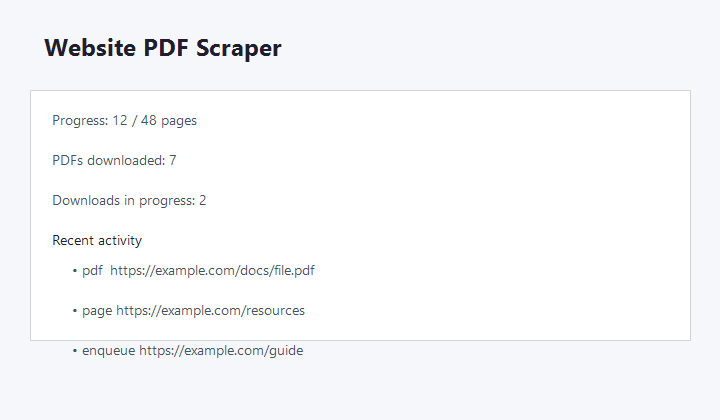

# Website PDF Scraper

A multithreaded Python crawler with a Streamlit interface that traverses an entire website, downloads PDF files, and mirrors their page structure on disk. It respects robots.txt by default, supports rate limiting, resume from state, and produces structured reports.



## Features

- Streamlit one-page UI with sidebar controls, live metrics, log tail, and start/pause/resume/stop buttons.
- Concurrent crawling and downloading using `ThreadPoolExecutor` pools with a global rate limiter.
- Robots.txt compliance (toggleable) and same-domain restriction safeguards.
- Include/exclude regex filters, max depth, adjustable concurrency, and requests-per-second throttling.
- Per-page PDF foldering that reflects the site hierarchy and page titles.
- Persistent crawl state (`crawl_state.json`) for pause/resume and `report.json` summarizing results.
- Structured logging to `logs/scraper.log` with recent-activity feed in the UI.
- PDF de-duplication cache with per-page copies, SHA-1 hashing ready via utilities, and replay-safe downloads.
- Unit and integration tests powered by `pytest`.

## Quick Start

```bash
python -m venv .venv
.venv\Scripts\activate  # Windows
pip install -r requirements.txt
streamlit run app.py
```

1. Enter a start URL in the sidebar.
2. Adjust depth, rate limit, concurrency, and filters as needed.
3. (Optional) enable resume to pick up from an existing `crawl_state.json`.
4. Click **Start** and watch progress/metrics update in real time.

Scraped PDFs land under `downloads/<domain>/...`, while logs, state, and reports live in `logs/`, `crawl_state.json`, and `report.json` respectively.

## Configuration

Defaults live in `config.toml`. Override output paths, rate limits, retry policies, and user agent there. Settings are loaded at app start.

## Tests

Run tests after installing dependencies:

```bash
pytest
```

The suite includes:
- `tests/test_utils.py` covering URL normalization, domain checks, and filesystem naming.
- `tests/test_crawler_integration.py` launching a temporary HTTP server to verify PDF downloads and report generation.

## Project Structure

```
app.py                  # Streamlit UI
scraper/                # Crawling engine package
  config.py
  crawler.py
  rate_limit.py
  robots.py
  state.py
  utils.py
tests/                  # Pytest suite
config.toml             # Default configuration
requirements.txt        # Python dependencies
docs/ui-placeholder.png # UI preview asset
```

## Notes

- Respect robots.txt when scraping third-party sites unless you have permission to ignore it.
- The crawler streams downloads to avoid high memory usage and retries failed HTTP calls with backoff.
- Report output (`report.json`) records start URL, depth, duration, page stats, and skipped URLs.

Happy scraping!
# crawrels

